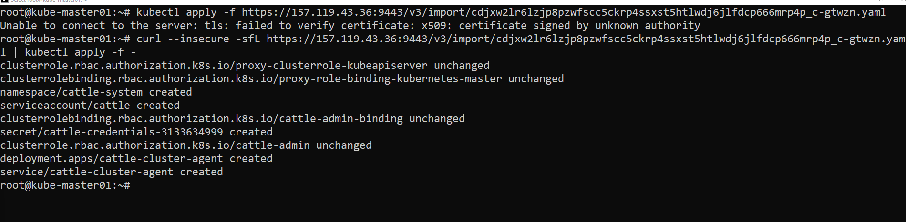

## 🚀 **Best & Easiest Rancher Setup: Docker Single Node (for Demo or Lab)**

This is the **fastest** method — ideal for labs, training, and testing Kubernetes cluster management.

---

### 🧩 **Requirements**

| Component | Minimum Requirement                   |
| --------- | ------------------------------------- |
| OS        | Ubuntu 22.04 LTS / Rocky 9 / CentOS 9 |
| CPU       | 2 vCPUs                               |
| RAM       | 4 GB minimum (8 GB recommended)       |
| Disk      | 20 GB                                 |
| Docker    | Installed and running                 |
| Port      | 80, 443 open                          |

---

### 🧰 **Step 1: Install Docker**

```bash
sudo apt update -y
sudo apt install -y docker.io
sudo systemctl enable docker --now
sudo usermod -aG docker $USER
```

(Logout & login again to apply group changes.)

---

### 🧱 **Step 2: Launch Rancher using Docker**

```bash
sudo docker run -d \
  --restart=unless-stopped \
  -p 80:80 -p 443:443 \
  rancher/rancher:latest
```

✅ Rancher will automatically start and run on ports **80 (HTTP)** and **443 (HTTPS)**.

---

### 🧩 **Step 3: Access Rancher UI**

1. Open a browser →
   👉 `https://<your-server-public-ip>`
2. Accept the SSL warning.
3. Set **admin password** (first login).
4. Add your **node/cluster** using:

   * *Import existing cluster*, or
   * *Create new cluster* (local / RKE / EKS / AKS / GKE)

---

### 🧠 **Step 4 (Optional): Persistent Data (for production or VM reboot)**

If you want to persist Rancher data:

```bash
sudo docker run -d \
  --restart=unless-stopped \
  -p 80:80 -p 443:443 \
  -v /opt/rancher:/var/lib/rancher \
  rancher/rancher:latest
```

* Register the kubernetess to Rancher 


if its "Not connected"
the agent on the kubernetes for Rancher is not working fine 

```
root@kube-master01:~# kubectl -n cattle-system get pods
NAME                                   READY   STATUS   RESTARTS      AGE
cattle-cluster-agent-7df4c5b46-wjtzt   0/1     Error    2 (23s ago)   75s
root@kube-master01:~#


```

Reset the password
```
docker exec -it <container-id-or-name> reset-password
# it will prompt:
# New password for default administrator (user-xxxxx):
# <enter-new-password>
```


---

## ⚙️ **Alternative: Rancher on Kubernetes (for Production)**

If you already have a Kubernetes cluster (e.g. with K3s, RKE2, or AKS):

1. Install **Helm**

   ```bash
   curl https://raw.githubusercontent.com/helm/helm/main/scripts/get-helm-3 | bash
   ```
2. Add Rancher repo

   ```bash
   helm repo add rancher-stable https://releases.rancher.com/server-charts/stable
   helm repo update
   ```
3. Create `cattle-system` namespace

   ```bash
   kubectl create namespace cattle-system
   ```
4. Install Rancher with Helm

   ```bash
   helm install rancher rancher-stable/rancher \
     --namespace cattle-system \
     --set hostname=<your-domain-name>
   ```
5. Verify installation

   ```bash
   kubectl -n cattle-system get pods
   ```

---

## 🧭 **Which one should you choose?**

| Use Case                | Recommended Setup                 |
| ----------------------- | --------------------------------- |
| Quick demo / Lab        | **Docker single-node setup** ✅    |
| Production / multi-node | **Helm on K3s or RKE2**           |
| Lightweight local setup | **Rancher Desktop** (Windows/Mac) |


