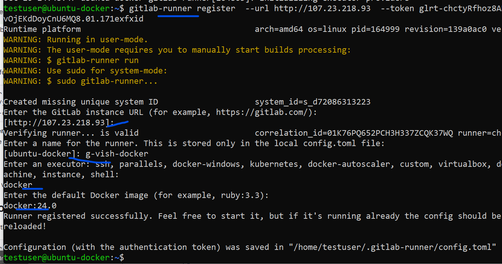

## 🧩 **Scenario: Deploy Docker Compose App via GitLab CI/CD**

We’ll create a GitLab pipeline that:

1. Builds Docker images for the Python app.
2. Pushes the image to **GitLab Container Registry**.
3. Connects via **SSH to a remote host** (like an EC2/VM) and deploys using `docker-compose`.

---

## 📁 **Project Structure**

```
project-root/
│
├── .gitlab-ci.yml
├── docker-compose.yml
├── app.py
└── python-app/
    ├── Dockerfile
    └── requirements.txt
```

---

## ⚙️ **Step 1 — GitLab Container Registry Setup**

1. In your GitLab project, go to:
   **Settings → Packages & Registries → Container Registry**

2. Note your registry path, e.g.

   ```
   registry.gitlab.com/<username>/<project>
   ```

3. Create a **Personal Access Token** or use **CI/CD Variables** for authentication:

   * `CI_REGISTRY_USER` → usually `$CI_REGISTRY_USER` (GitLab built-in)
   * `CI_REGISTRY_PASSWORD` → `$CI_REGISTRY_PASSWORD`
   * `CI_REGISTRY` → `registry.gitlab.com`

---

## 🐳 **Step 2 — Update Docker Compose**

Use the GitLab image for the Python app instead of building locally every time.

```yaml
version: "3.9"

services:
  redis:
    image: redis:latest
    container_name: redis-server
    ports:
      - "6379:6379"

  python-app:
    image: registry.gitlab.com/<username>/<project>/python-app:latest
    container_name: python-app
    environment:
      - REDIS_HOST=redis
      - REDIS_PORT=6379
    ports:
      - "5000:5000"
    depends_on:
      - redis
```

---

## 🧱 **Step 3 — Dockerfile (python-app/Dockerfile)**

```dockerfile
FROM python:3.10-slim

WORKDIR /app

COPY requirements.txt .
RUN pip install --no-cache-dir -r requirements.txt

COPY ../app.py /app/app.py

CMD ["flask", "run", "--host=0.0.0.0"]
```

---

## 🧩 **Step 4 — GitLab CI/CD Pipeline (.gitlab-ci.yml)**

Here’s a **3-stage pipeline**:

1. **Build** the Docker image
2. **Push** the image to GitLab registry
3. **Deploy** on a remote server via SSH

```yaml
stages:
  - build
  - push
  - deploy

variables:
  DOCKER_DRIVER: overlay2
  IMAGE_NAME: registry.gitlab.com/$CI_PROJECT_PATH/python-app

# --- Build stage ---
build-image:
  stage: build
  image: docker:24.0
  services:
    - docker:dind
  script:
    - echo "Building Docker image..."
    - docker build -t $IMAGE_NAME:$CI_COMMIT_SHORT_SHA python-app
  artifacts:
    expire_in: 1 hour
  only:
    - main

# --- Push stage ---
push-image:
  stage: push
  image: docker:24.0
  services:
    - docker:dind
  script:
    - echo "Logging in to GitLab Registry..."
    - docker login -u $CI_REGISTRY_USER -p $CI_REGISTRY_PASSWORD $CI_REGISTRY
    - echo "Tagging image..."
    - docker tag $IMAGE_NAME:$CI_COMMIT_SHORT_SHA $IMAGE_NAME:latest
    - echo "Pushing image to GitLab Container Registry..."
    - docker push $IMAGE_NAME:latest
  only:
    - main
  dependencies:
    - build-image

# --- Deploy stage ---
deploy-to-server:
  stage: deploy
  image: alpine:latest
  before_script:
    - apk add --no-cache openssh-client
  script:
    - echo "Deploying to remote host..."
    - mkdir -p ~/.ssh
    - echo "$SSH_PRIVATE_KEY" | tr -d '\r' > ~/.ssh/id_rsa
    - chmod 600 ~/.ssh/id_rsa
    - ssh -o StrictHostKeyChecking=no $SSH_USER@$SSH_HOST "
        cd $DEPLOY_DIR &&
        docker-compose pull &&
        docker-compose up -d --remove-orphans
      "
  only:
    - main
```

---

## 🔐 **Step 5 — Add GitLab CI/CD Variables**

Go to
**Settings → CI/CD → Variables → Add Variable**

| Variable               | Example                         | Purpose                        |
| ---------------------- | ------------------------------- | ------------------------------ |
| `SSH_USER`             | `ubuntu`                        | Remote host user               |
| `SSH_HOST`             | `52.66.x.x`                     | Remote host public IP          |
| `DEPLOY_DIR`           | `/home/ubuntu/python-redis-app` | Path where compose files exist |
| `SSH_PRIVATE_KEY`      | *(private key content)*         | To SSH into target VM          |
| `CI_REGISTRY_USER`     | `gitlab-ci-token`               | Default GitLab variable        |
| `CI_REGISTRY_PASSWORD` | `$CI_JOB_TOKEN`                 | Default GitLab variable        |

---

## 🚀 **Step 6 — Prepare Remote Server (Deployment Target)**

On your target Linux VM (EC2/VM):

```bash
sudo apt update && sudo apt install -y docker.io docker-compose git
```

Clone your GitLab repo:

```bash
git clone https://gitlab.com/<username>/<project>.git
cd <project>
```

Ensure your `docker-compose.yml` and `.env` files exist in this folder.

---

## 🧠 **Step 7 — Trigger Deployment**

1. Push code changes to the `main` branch:

   ```bash
   git add .
   git commit -m "Deploy via GitLab CI/CD"
   git push origin main
   ```

2. GitLab Pipeline runs:

   * **Builds** the Docker image.
   * **Pushes** to GitLab Container Registry.
   * **SSHs** into remote host and runs `docker-compose up -d`.

3. Access your app:

   ```
   http://<your-server-public-ip>:5000
   ```

---

## 🧩 **Optional Enhancements**

* Add a **staging** environment by creating another deploy job with branch condition (`only: [staging]`).
* Add **Slack/Webhook notifications** on success/failure.
* Use **GitLab Environments** for versioned deployments.

---

## ✅ **Summary Workflow**

| Stage  | Description               | Tool             |
| ------ | ------------------------- | ---------------- |
| Build  | Create Docker image       | Docker-in-Docker |
| Push   | Upload to GitLab Registry | GitLab CI        |
| Deploy | SSH + docker-compose up   | Remote Server    |


Ref image: 